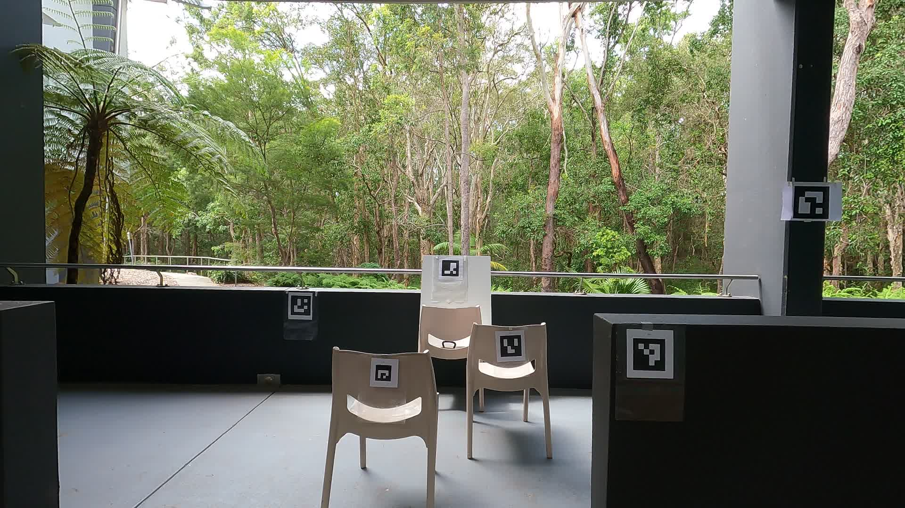

# Monocular-depth
Monocular Depth Estimation Models Project by GLOW - Only Showing Results
A Project I worked on during my time at The Global Wetlands Project.

# Documentation

## Calibration and Testing Procedures

### Calibration with AruCo Board
1. Secure the GoPro camera in a stationary position.
2. Record movements of an AruCo board in multiple directions, ensuring it occasionally exits the camera's view for thorough calibration.
3. Forward this data for calibration analysis.

### Testing with Markers
1. Fix the GoPro in a predetermined location.
2. Position the markers at specific fixed distances from the camera (i.e. 1m, 2m , 3m, etc.).
3. Log details in Excel:
    - date
    - camera_id
    - box_size (marker)
    - fix_distance 
    - diagonal_distance - measured from the center of the camera to the center of the maker
    - camera_height
4. Record short (10 seconds) videos.
    - Can record more tests with varying marker setup
5. Trim recorded videos if necessary.
6. Extract frames from videos (2fps).
7. Use a single frame to test both `depth_anything` and `metric_depth` models.
    - markers closer should appear brighter
    - markers further should appear darker
8. Upload results to SharePoint.

## Depth Estimation and Error Analysis
Employ the `depth_anything` and `metric_depth` models on the extracted frames, comparing the estimated depths against actual measurements. This analysis aims to evaluate the models' precision and examine the visibility variation of markers based on depth.

## Results
This section will document the application of "Depth-Anything" models to our project's video recordings, emphasizing the accuracy of depth estimations, the challenges faced, and the performance of QR code visibility in relation to estimated depth. The unique approach of combining a vast unlabeled dataset with a smaller labeled one allows for refined depth perception and potential enhancements in future iterations.

## Indoor Test 1:
**Depth Anything Model:**
](media/output/gp9-27_GX010042_frame_0001_img_depth.png)

**Metric Depth Model:**

  
   

## Indoor Test 2:
**Depth Anything Model:**
](media/output/gp9-27_GX010047_frame_0001_img_depth.png)

**Metric Depth Model:**

  
   

## Outdoor Test 1:
**Depth Anything Model:**
](media/output/gp9-27_GX010051_frame_0001_img_depth.png)

**Metric Depth Model:**

  
   

